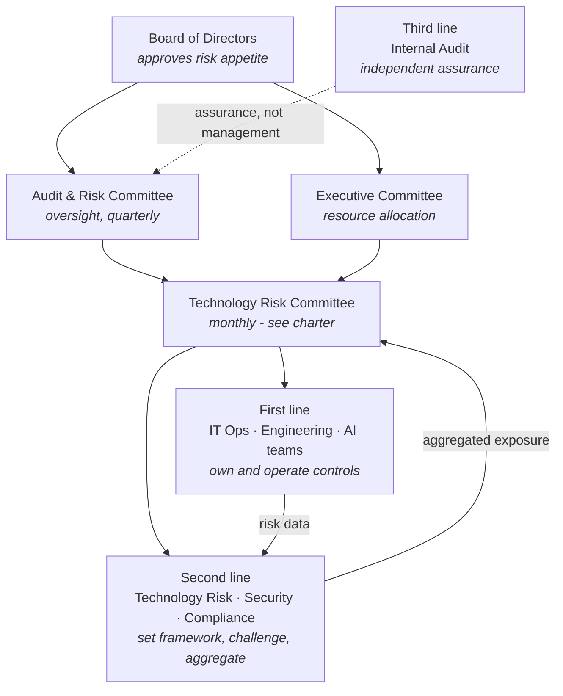
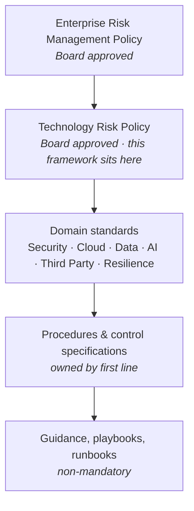
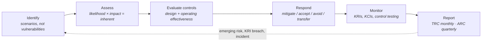

# Technology Risk Governance Framework

> ⚠️ Constructed case study. See [`../00-programme/disclaimer.md`](../00-programme/disclaimer.md).

**CRISC Domain 1 — Governance (26% of the exam blueprint)**
**Role played:** Technology Risk & Governance Consultant

---

## 1. Why this framework exists

Northstar Global manages technology risk in five places and reconciles it in none. Cybersecurity runs a
threat register. IT Operations tracks incidents and problem records. The AI steering group keeps a list of
pilots. Finance owns SOX-adjacent IT controls. Compliance maintains a regulatory obligations matrix.

Each is competent. Collectively they cannot answer the question the Board asked in March: *what is our
total technology risk exposure, and how much of it is above what we are willing to carry?*

That question is unanswerable today for three structural reasons, and this framework addresses each:

| Problem | Consequence | Addressed by |
| --- | --- | --- |
| No common risk taxonomy | The same cloud outage is a "resilience risk" to IT and a "vendor risk" to Procurement. Cannot aggregate. | Section 3 |
| No risk appetite statement | "High risk" is an adjective, not a threshold. Nothing forces a decision. | [Risk appetite & tolerance](./02-risk-appetite-and-tolerance.md) |
| No accountability model | Risks have authors, not owners. Treatment stalls without escalation. | [Risk ownership matrix](./03-risk-ownership-matrix.md) |

## 2. Governance structure

### Three lines — who does what

| Line | Function | Accountable for | Explicitly NOT accountable for |
| --- | --- | --- | --- |
| **First** | IT Operations, Engineering, Application teams, AI product owners | Owning risks in their domain; designing and operating controls; reporting accurately | Deciding what level of risk is acceptable |
| **Second** | Technology Risk, Information Security, Compliance | The framework, taxonomy and methodology; independent challenge; aggregation and reporting | Owning the risks they assess, or operating the controls they test |
| **Third** | Internal Audit | Independent assurance that lines one and two work as designed | Designing controls, or advising on treatment |

The most common failure of this model is the second line accumulating operational control ownership
because it has the expertise and the first line does not. When Technology Risk owns a control, nobody is
left to challenge it. Where this framework assigns Technology Risk as control owner (nowhere, currently),
it is a defect to be corrected, not a convenience.

Internal Audit's dotted line to the Audit & Risk Committee rather than to management is deliberate and is
the only reporting line in this diagram that cannot be varied without breaking independence.

## 3. Technology risk taxonomy

A taxonomy is not a filing system. It exists so that two people assessing the same event categorise it the
same way, which is what makes aggregation meaningful.

| L1 Category | L2 Sub-category | Example scenario |
| --- | --- | --- |
| **Cybersecurity** | Identity & access · Malware/ransomware · Data exfiltration · Vulnerability management | Credential compromise leading to fraudulent payment |
| **Cloud & Infrastructure** | Configuration · Capacity · Platform dependency · Migration | Misconfigured storage exposing customer data |
| **Data** | Quality · Privacy · Retention · Sovereignty | Personal data retained beyond lawful basis |
| **Third Party** | Concentration · Vendor failure · Subcontractor (4th party) · Exit | Extended SaaS outage halting order processing |
| **Emerging Technology** | AI/ML governance · Agentic autonomy · Model risk · Shadow adoption | AI agent acting outside intended authority |
| **Technology Operations** | Change · Incident · Capacity · Asset lifecycle | Unauthorised change causing production outage |
| **Resilience** | Availability · Recovery · Business continuity | Recovery time exceeding tolerable disruption |
| **Compliance & Regulatory** | Statutory · Contractual · Reporting | Failure to notify within regulatory window |

### Taxonomy rules

1. **Every risk scenario is assigned exactly one L1 category** — the one where the *primary loss* occurs,
   not where the trigger originates. A vendor breach exposing customer data is categorised **Data**, with
   Third Party recorded as the causal driver. Without this rule the same scenario appears twice and
   aggregate exposure is overstated.
2. **Causal drivers are recorded separately from category.** This is what lets you say "41% of our
   exposure has a third-party driver" without double-counting.
3. **New sub-categories require Technology Risk Committee approval.** Uncontrolled taxonomy growth is how
   registers become unaggregatable.

## 4. Policy hierarchy

| Tier | Approval authority | Review cycle | Mandatory |
| --- | --- | --- | --- |
| Policy | Board | Annual | Yes |
| Standard | Technology Risk Committee | Annual | Yes |
| Procedure | Domain owner (first line) | On change, min. 2-yearly | Yes |
| Guidance | Domain owner | As needed | No |

**Exceptions to any mandatory tier require a documented, time-boxed exception with a named approver, a
compensating control and an expiry date.** An exception without an expiry is a silent policy amendment.

## 5. Risk management lifecycle

Each stage has a defined owner, output artefact and cadence — set out in the
[risk ownership matrix](./03-risk-ownership-matrix.md).

## 6. Risk culture

Framework documents describe structure; structure alone does not produce good risk data. Three behaviours
determine whether this framework works, and all three are measurable:

| Behaviour | Measured by | Why it matters |
| --- | --- | --- |
| Risks are raised early, including uncomfortable ones | Ratio of risks self-identified by first line vs. found by audit or incident | If audit finds most risks, the first line is not reporting |
| Accepted risk is a decision, not a default | Proportion of above-appetite risks with a formal, time-boxed acceptance | Silent acceptance is the most common governance failure |
| Treatment completes | Proportion of risk action plans closed on or before due date | Registers with permanent overdue items train executives to ignore them |

## 7. Framework scope and limitations

**In scope:** all technology risk across Northstar's six operating countries, including cloud, AI,
third-party technology dependencies and operational technology at the IT boundary.

**Out of scope:** non-technology operational risk (health and safety, physical security, employment),
financial and market risk, and OT process control networks beyond the IT boundary — the last of these is
a known gap and is recorded as such at the Audit & Risk Committee rather than quietly excluded.

**Dependency:** this framework assumes an accurate technology asset inventory. Northstar's is incomplete —
particularly for SaaS acquired outside IT procurement and for AI tooling. Risk identification is therefore
demonstrably incomplete at launch, and improving inventory coverage is itself tracked as a governance
action rather than assumed away.

---

## Artefacts in this project

| Artefact | Purpose |
| --- | --- |
| This framework | Structure, taxonomy, policy hierarchy, lifecycle |
| [Risk appetite & tolerance statement](./02-risk-appetite-and-tolerance.md) | The thresholds that convert judgement into decisions |
| [Risk ownership matrix](./03-risk-ownership-matrix.md) | Who owns, who operates, who challenges, who assures |
| [Technology Risk Committee charter](./04-risk-committee-charter.md) | Mandate, membership, decision rights, escalation |
