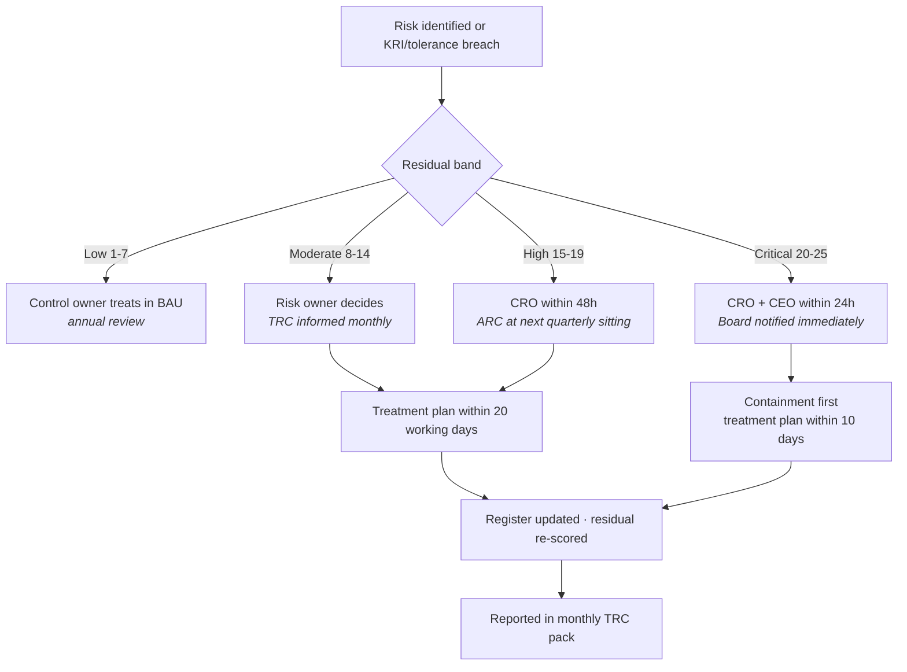

# Risk Ownership Matrix

> ⚠️ Constructed case study. See [`../00-programme/disclaimer.md`](../00-programme/disclaimer.md).

**Owned by:** Chief Risk Officer · **Review:** Annual, or on organisational change

---

## The distinction that makes this work

Three roles are routinely collapsed into one, which is why treatment stalls:

| Role | Accountable for | Can delegate? | Typically |
| --- | --- | --- | --- |
| **Risk owner** | The *outcome* if the risk materialises. Decides whether to treat or accept. Funds treatment. | No — accountability sits with the individual | Executive (C-level or direct report) |
| **Control owner** | The control being *designed correctly and operating consistently*. Produces evidence. | Operation yes, accountability no | Function head or senior manager |
| **Action owner** | Delivering a specific treatment action by a date | Yes | Whoever does the work |

A risk owner who is also the control owner has no independent check on their own assurance. A risk with no
named individual owner has, in practice, no owner — "IT Security" cannot be held to account at a Board
meeting.

**Risk owners are individuals, not functions.** Every entry below names a role held by one person.

---

## Ownership by risk category

| Risk category | Risk owner | Control owner(s) | Second-line challenge | Assurance |
| --- | --- | --- | --- | --- |
| Cybersecurity — identity & access | CISO | Head of IAM | Technology Risk | Internal Audit |
| Cybersecurity — malware/ransomware | CISO | Head of Security Operations | Technology Risk | Internal Audit |
| Cybersecurity — vulnerability mgmt | CISO | Head of Infrastructure | Technology Risk | Internal Audit |
| Cloud & infrastructure | CIO | Head of Cloud Platform | Technology Risk · Security | Internal Audit |
| Data — privacy | Chief Compliance Officer | Data Protection Officer | Technology Risk | Internal Audit · external DPA |
| Data — quality & retention | CIO | Head of Data | Technology Risk | Internal Audit |
| Third party | Procurement Director | Vendor Manager · contracting business owner | Technology Risk · Legal | Internal Audit |
| Emerging technology / AI | CIO | AI product owners (per system) | Technology Risk · Compliance | Internal Audit |
| Technology operations | CIO | Head of IT Operations | Technology Risk | Internal Audit |
| Resilience | COO | Head of IT Operations · business process owners | Technology Risk | Internal Audit |
| Compliance & regulatory | Chief Compliance Officer | Function heads | Technology Risk | Internal Audit · external audit |

Two allocations are deliberate and would be argued differently elsewhere:

**Resilience is owned by the COO, not the CIO.** The consequence of an outage is unfulfilled customer
orders, which is an operations outcome. If the CIO owns it, resilience investment competes against other
IT priorities inside one budget rather than being demanded by the business that suffers the loss.

**AI risk is owned by the CIO with control ownership devolved to individual AI product owners.** Central
ownership of every AI system does not survive contact with ten teams deploying independently. The CIO owns
the aggregate exposure; each system has a named owner accountable for its authority boundary.

---

## RACI across the risk lifecycle

**R** Responsible · **A** Accountable · **C** Consulted · **I** Informed

| Activity | Risk owner | Control owner | Technology Risk (2L) | TRC | Internal Audit | ARC |
| --- | :-: | :-: | :-: | :-: | :-: | :-: |
| Maintain framework & taxonomy | C | I | **A/R** | C | I | I |
| Set risk appetite | C | I | R | C | I | **A** (recommends to Board) |
| Identify risk scenarios | **A** | R | C | I | I | I |
| Assess likelihood & impact | **A** | C | R | I | I | I |
| Challenge assessment | I | I | **A/R** | C | I | I |
| Test control effectiveness | I | R | **A** | I | C | I |
| Select treatment response | **A/R** | C | C | I | I | I |
| Approve treatment funding | R | I | C | **A** | I | I |
| Deliver treatment actions | A | R | I | I | I | I |
| Accept residual risk (Moderate) | **A/R** | C | C | I | I | I |
| Accept residual risk (High) | R | I | C | C | I | **A** |
| Accept residual risk (Critical) | R | I | C | C | I | R (Board **A**) |
| Monitor KRIs/KCIs | I | R | **A** | C | I | I |
| Report aggregate exposure | C | I | R | **A** | I | C |
| Independent assurance | I | I | C | I | **A/R** | C |

The single most important row is *challenge assessment*: Technology Risk is accountable, and the risk
owner is only informed. If the first line can overrule second-line challenge, the second line is
administrative support rather than a control.

Internal Audit appears as **C** on framework and reporting and **A** only on assurance. Audit advising on
the framework it later assures is the independence failure that most commonly gets flagged in external
review.

---

## Escalation routing

---

## Where ownership is currently contested

An honest matrix records the arguments it hasn't settled. Three are open at Northstar and are on the
Technology Risk Committee agenda:

| Issue | Positions | Status |
| --- | --- | --- |
| SaaS acquired by business units outside IT procurement | CIO argues the acquiring business unit owns the risk; business units argue IT owns all technology | Unresolved — currently unowned, which is the worst outcome. Interim: CIO owns aggregate, business unit owns instance. |
| AI agents built on Power Platform by non-IT staff | Same structural argument as above | Interim ownership with CIO pending AI system registration completing |
| OT boundary systems at the two largest plants | COO owns process; CIO owns the AD-integrated front end; neither owns the boundary itself | Escalated to Executive Committee |

All three share a shape: technology adopted outside the process the ownership model assumes. That is not
an argument for a better matrix — it is an argument for making adoption visible, which is why asset
inventory coverage is a Board-level tolerance (T-09).
