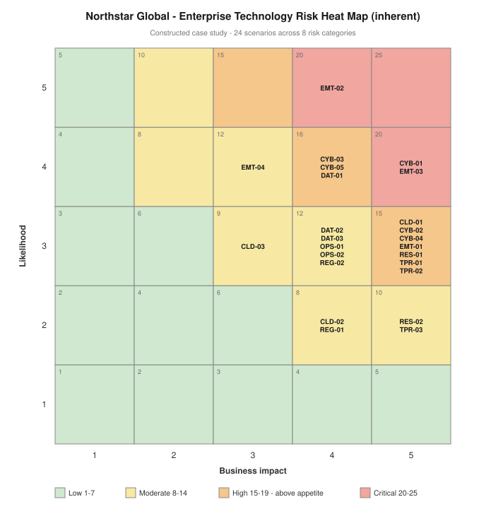

# Project 02 — Enterprise Risk Assessment & Register

> ⚠️ Constructed case study. See [`../00-programme/disclaimer.md`](../00-programme/disclaimer.md).

**CRISC Domain 2 — Risk Assessment (22%)**
**Role played:** Technology Risk Consultant · **Duration modelled:** 10 weeks

---

## The one-paragraph version

Northstar Global ran technology risk in five disconnected registers that could not be summed. I assessed
the enterprise across eight risk categories, constructed 24 risk scenarios with named owners and evidence
bases, and scored each on likelihood and business impact. Aggregate inherent exposure is **330**, with
**13 of 24 scenarios (54%) above the Board's appetite threshold** and three Critical. Not one existing
control was assessed as Effective. Two-thirds of exposure originates in internal control weakness rather
than external threat — meaning most of it is addressable by internal decision.

## Artefacts

| # | Artefact | What it demonstrates |
| --- | --- | --- |
| 1 | [Assessment methodology](./01-assessment-methodology.md) | Scenario construction, evidence sources, control-effectiveness gating, aggregation rules, limitations |
| 2 | [Enterprise register — CSV](./02-enterprise-risk-register.csv) | 24 scenarios, full column set: causal driver, business objective, control effectiveness, evidence basis |
| 3 | [Enterprise register — readable](./03-enterprise-risk-register.md) | Heat map, exposure by category, top-10 profile, causal driver analysis |
| 4 | [Executive assessment](./04-executive-assessment.md) | Board-level findings and five recommendations |
| 5 | [Identity & access deep-dive](./identity-deep-dive/) | Completed sub-assessment: 14 scenarios with control testing, treatment design and measured residual risk |

## The methodological point this project makes

**Findings are not risks.** "MFA is not enforced" has no likelihood and no impact, so it cannot be scored,
prioritised or accepted. Every entry in this register is a scenario — *if* threat acting on weakness,
*then* consequence, *resulting in* business impact — tied to a business objective and a named owner.
Registers full of findings are the most common reason risk reporting fails to influence investment.

**Control effectiveness gates likelihood.** Existing controls reduce likelihood only where tested as
effective. A published-but-unenforced policy, a backup that runs but is never restored, a questionnaire
completed at onboarding and never revisited — each creates assurance without protection. Zero of 24
controls were rated Effective, which is why aggregate exposure is as high as it is.

**Inherent only.** Residual scoring waits for control testing in Project 03. Residual risk asserted
before controls are tested is an estimate wearing the costume of a measurement.

## Relationship to the identity deep-dive

The [identity and access sub-assessment](./identity-deep-dive/) is a completed worked example carried
through the full cycle — 14 scenarios, control testing, treatment design, measured residual risk (202 →
90, a 55% reduction) and executive reporting.

Its scenarios **roll up** into CYB-01, CYB-04 and EMT-03 in this register rather than appearing twice.
That aggregation rule is what keeps enterprise exposure honest when sub-assessments exist at different
depths.

## Feeds

Appetite thresholds and taxonomy come from
[Project 01 — Governance Framework](../01-governance-framework/).
The 13 above-appetite scenarios are the input to Project 03 — Control Assessment & Risk Treatment.
