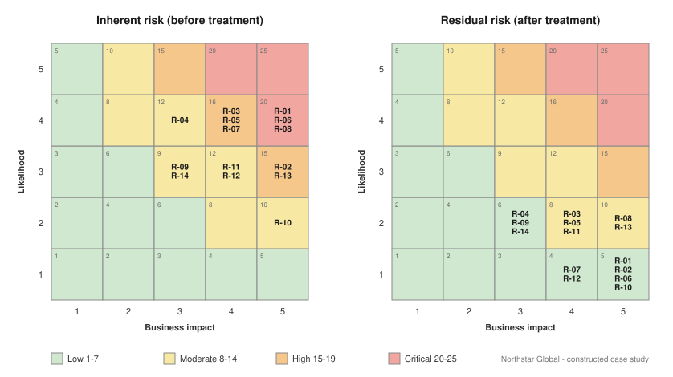

# 04 — Identity Risk Register (readable view)

> ⚠️ Constructed case study. Northstar Global is fictional.
> Machine-readable source: [`03-risk-register.csv`](./03-risk-register.csv) — full column set including
> control effectiveness, framework mappings, control owners and review dates.

Scoring model, risk bands and the appetite statement are defined in
[`01-scope-and-methodology.md`](./01-scope-and-methodology.md).

## Summary position

| Measure | Inherent | Residual | Change |
| --- | --- | --- | --- |
| Aggregate score (14 scenarios) | 202 | 90 | −55% |
| Scenarios above appetite (≥15) | 8 | 0 | −8 |
| Critical band (20–25) | 3 | 0 | −3 |
| Low band (1–7) | 0 | 6 | +6 |
| Highest single scenario | 20 | 10 | −50% |

## Register

| ID | Risk scenario (abbreviated) | Category | L | I | Inherent | Treatment | Res. | Owner | Evidence |
| --- | --- | --- | :-: | :-: | :-: | --- | :-: | --- | --- |
| R-01 | Terminated employees retain active accounts and application access | Lifecycle | 4 | 5 | **20** | Automated HR-driven leaver deprovisioning, same-day disable | 5 | CIO | Lab 2 |
| R-02 | Permanent standing Global Admin / Privileged Role Admin assignments | Privileged Access | 3 | 5 | **15** | PIM eligible assignments, approval, MFA on activation, 4h max | 5 | CISO | Lab 9 |
| R-03 | Contractors retain access beyond engagement end | Lifecycle | 4 | 4 | **16** | Mandatory sponsor + expiry on non-employee identities | 8 | COO | Lab 9 |
| R-04 | Entitlement accumulation after internal transfer | Entitlement Creep | 4 | 3 | 12 | Mover-triggered recalculation + manager re-certification | 6 | HR Director | Lab 2 |
| R-05 | No periodic access certification for critical applications | Governance | 4 | 4 | **16** | Quarterly certification, Tier 1 apps, auto-revoke on non-response | 8 | CFO | Lab 9 |
| R-06 | MFA not consistently enforced; coverage gaps | Authentication | 4 | 5 | **20** | Conditional Access MFA for all users; phishing-resistant for admins | 5 | CISO | Labs 5, 6 |
| R-07 | Legacy authentication permitted, bypasses CA and MFA | Authentication | 4 | 4 | **16** | Block legacy auth after dependency remediation | 4 | CISO | Lab 6 |
| R-08 | Workload identities and AI agents hold broad unreviewed Graph permissions | Workload Identity | 4 | 5 | **20** | Inventory, ownership, least-privilege revocation; full governance deferred | 10 | CISO | Labs 6, 10 |
| R-09 | Guest / B2B accounts without expiry, sponsor or review | External Access | 3 | 3 | 9 | Access packages with sponsor, expiry, semi-annual review | 6 | CISO | Lab 9 |
| R-10 | Break-glass accounts undocumented, unmonitored, untested | Privileged Access | 2 | 5 | 10 | Two defined accounts, FIDO2 custody, sign-in alerting, tested use | 5 | CISO | Labs 9, 10 |
| R-11 | Shared / service accounts with static, unrotated passwords | Non-human Identity | 3 | 4 | 12 | Managed identities / workload identity federation; vaulted rotation | 8 | CIO | Lab 6 |
| R-12 | Critical app access permitted from non-compliant devices | Device Trust | 3 | 4 | 12 | CA device compliance grant control for Tier 1 apps | 4 | CIO | Lab 6 |
| R-13 | Undetected Segregation of Duties conflicts in finance | Segregation of Duties | 3 | 5 | **15** | SoD matrix encoded as mutually exclusive access packages | 10 | CFO | Lab 9 |
| R-14 | Identity log retention insufficient for investigation | Monitoring | 3 | 3 | 9 | Log Analytics routing, 12-month retention, KRI workbook | 6 | CISO | Lab 10 |

**Bold** inherent scores are above the board-approved appetite threshold of 15.

## The four scenarios that drove the business case

**R-01, R-06, R-08 (Critical, score 20).** These are not ranked highest because they are technically
interesting. R-01 scores Impact 5 because a terminated plant supervisor retained SAP access for 41 days in
the sample — access that could release a payment. R-06 scores Impact 5 because credential-only
authentication reaches finance data. R-08 scores Impact 5 because a service principal with
`Directory.ReadWrite.All` is functionally a Global Administrator that nobody is watching and no leaver
process will ever disable.

**R-13 (High, score 15).** The only scenario with a named regulatory consequence. Vendor creation combined
with payment release in a single person's entitlements is the textbook SoD conflict, and it is the finding
most likely to become a material audit weakness if left undetected.

## Where residual risk remains

Residual risk is not zero and is not presented as zero.

| ID | Residual | Why it remains |
| --- | --- | --- |
| R-08 | 10 | Entra ID P1 does not include Workload Identities Premium. Conditional Access for workload identities and workload identity risk detection require additional licensing, deferred to FY27. Formally accepted — see [`06-risk-acceptance-and-escalation.md`](./06-risk-acceptance-and-escalation.md). |
| R-13 | 10 | SoD detection is preventive at provisioning but detective for pre-existing conflicts. Impact remains 5; likelihood reduces only to 2 until the finance role redesign completes in FY27. |
| R-03, R-05, R-11 | 8 | Controls depend on human reviewers and sponsors responding. Likelihood cannot fall below 2 where the control has a manual step. |

An assessment that treats every risk to Low is not an assessment, it is a sales document. Impact rarely
moves — a compromised Global Administrator is catastrophic whether or not you have PIM. Treatment reduces
*likelihood*. Six of the fourteen scenarios retain an Impact score of 5 after treatment, and that is
correct.
