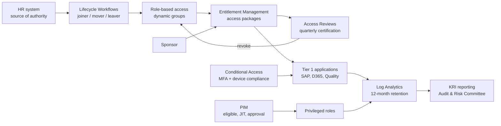

# 05 — Control-Gap Assessment

> ⚠️ Constructed case study. Northstar Global is fictional.

## Purpose

The risk register says what could go wrong. This says which controls are missing, how mature what exists
is, and where the target should sit. Target maturity is deliberately **not** 5 everywhere — a 2,000-person
manufacturer does not need optimised, continuously-improving identity governance in every domain, and
proposing it would fail the proportionality test the Audit & Risk Committee applies to every business case.

## Maturity scale

| Level | Name | Definition |
| --- | --- | --- |
| 0 | Absent | No control exists |
| 1 | Initial | Ad hoc, undocumented, person-dependent |
| 2 | Repeatable | Documented but inconsistently applied, unevidenced |
| 3 | Defined | Standardised, applied consistently, evidence produced |
| 4 | Managed | Measured with KPIs, exceptions tracked, reviewed |
| 5 | Optimised | Automated, continuously improved, predictive |

## Domain assessment

| # | Control domain | Current | Target | Gap | Related risks | ISO 27001:2022 |
| --- | --- | :-: | :-: | :-: | --- | --- |
| 1 | Identity lifecycle — joiner | 2 | 4 | 2 | R-04 | A.5.16 |
| 2 | Identity lifecycle — mover | 1 | 4 | 3 | R-04 | A.5.18 |
| 3 | Identity lifecycle — leaver | 1 | 4 | 3 | R-01 | A.5.18 |
| 4 | Non-employee / contractor lifecycle | 0 | 4 | 4 | R-03 | A.5.16 |
| 5 | External / guest identity governance | 1 | 3 | 2 | R-09 | A.5.16 |
| 6 | Authentication strength | 2 | 4 | 2 | R-06, R-07 | A.8.5 |
| 7 | Conditional / risk-based access | 1 | 4 | 3 | R-06, R-07, R-12 | A.5.15 |
| 8 | Device trust as an access condition | 1 | 3 | 2 | R-12 | A.5.15 |
| 9 | Privileged access management | 1 | 4 | 3 | R-02 | A.8.2 |
| 10 | Emergency / break-glass access | 1 | 4 | 3 | R-10 | A.8.2 |
| 11 | Access certification & recertification | 0 | 4 | 4 | R-05, R-09 | A.5.18 |
| 12 | Segregation of Duties | 0 | 3 | 3 | R-13 | A.5.15 |
| 13 | Entitlement / role model (RBAC) | 1 | 3 | 2 | R-04 | A.5.15 |
| 14 | Non-human & workload identity governance | 0 | 3 | 3 | R-08, R-11 | A.5.16 |
| 15 | Identity monitoring, logging & retention | 1 | 4 | 3 | R-14 | A.8.15 |
| 16 | Identity governance operating model | 1 | 3 | 2 | All | A.5.2 |
| | **Average** | **0.9** | **3.6** | **2.7** | | |

## The four largest gaps

**Domain 4 — Non-employee lifecycle (gap 4).** Nothing exists. Contractor identities are created like
employee identities and then forgotten, with no sponsor, no expiry and no owner. This is the cheapest
large gap to close because entitlement management is already licensed under the existing P1 estate for
internal use, and access packages solve sponsorship, expiry and review in a single construct.

**Domain 11 — Access certification (gap 4).** Also nothing. This is the gap most visible to auditors and
to customers issuing security questionnaires, because both ask the same question: *show me evidence that
someone competent reviewed this access recently.* Northstar currently cannot answer it for any system.

**Domain 2 and 3 — Mover and leaver (gap 3 each).** The mover gap is the quiet one. Leaver failures get
noticed eventually because someone spots a former colleague in a Teams channel. Mover failures are
invisible and compound — the plant supervisor promoted twice in four years now holds three roles' worth
of entitlements, and no process will ever remove them.

**Domain 14 — Workload identity governance (gap 3).** Rated target 3 rather than 4 because full maturity
requires Workload Identities Premium licensing that is not in the current budget cycle. Target 3 means:
complete inventory, named owner per identity, documented business justification, annual permission
review. That is achievable at current licensing and is the honest ceiling.

## Controls assessed as present but not effective

These matter disproportionately, because their existence creates false assurance. Management believed
five controls were operating. Testing showed otherwise.

| Control believed in place | Test performed | Result |
| --- | --- | --- |
| "MFA is enabled" | Per-user MFA state export vs. total enabled accounts | 71% registered, 0% policy-enforced. Contractors and service accounts excluded entirely. |
| "Admin accounts are separate" | Directory role assignment export | True, but all 68 privileged assignments are permanent and standing. Separation without time limitation is half a control. |
| "Guests are restricted" | Guest invitation settings + guest account export | Invitation is restricted; retention is not. 90 guests, oldest created 2021, 61 with no sign-in in 180 days. |
| "Application consent requires admin approval" | Graph enumeration of existing grants | Applies to *new* consent only. 340 existing service principals were never re-examined. |
| "Access is reviewed" | Requested evidence of last review for 4 critical apps | No evidence produced for any application. |

The pattern is consistent: Northstar has controls at the point of *granting* access and almost none at the
point of *retaining* it. That single sentence is the assessment's central finding, and every treatment
wave follows from it.

## Target-state architecture

