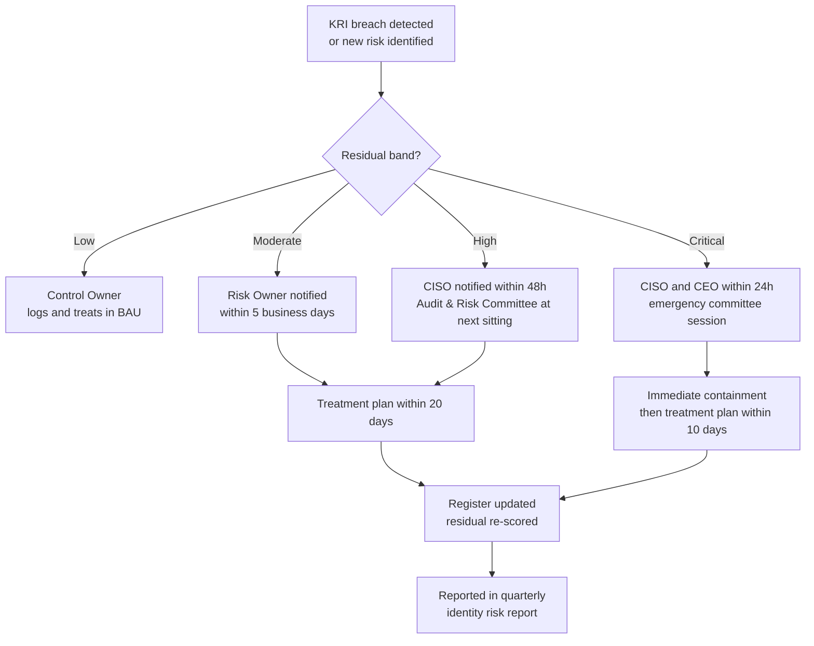

# 06 — Risk Acceptance & Escalation

> ⚠️ Constructed case study. Northstar Global is fictional.

## Part 1 — Risk acceptance process

Not every risk gets treated. The organisation needs a defensible way to say "we are carrying this
deliberately," and the difference between an accepted risk and an ignored risk is entirely documentary.

### Acceptance authority

| Residual band | Acceptance authority | Maximum acceptance period | Conditions |
| --- | --- | --- | --- |
| Low (1–7) | Control Owner | 12 months | Annual review, named owner |
| Moderate (8–14) | Risk Owner (executive) | 6 months | Named owner, monitoring KRI, documented compensating control, review date |
| High (15–19) | CISO + Audit & Risk Committee noting | 3 months | Written justification, compensating controls, remediation commitment with a date |
| Critical (20–25) | CEO, with Audit & Risk Committee approval | Not permitted as a standing position | Time-boxed only, pending active treatment already funded |

Critical risk cannot be accepted as a resting state. It can only be *carried* while treatment is in
flight, with an end date. Anything else means the appetite statement is decorative.

### Acceptance record — required fields

Every accepted risk carries a record with: risk ID and scenario, residual score and band, accepting
authority and date, business justification, compensating controls in place, monitoring KRI and threshold,
expiry date, and the trigger conditions that force early re-evaluation.

### Active acceptances in this assessment

**ACC-01 — R-08, workload identity governance (residual 10, Moderate)**

| Field | Detail |
| --- | --- |
| Accepting authority | CISO |
| Justification | Full workload identity governance requires Workload Identities Premium licensing at approximately CAD 68,000 annually. Not in the current fiscal budget. Partial treatment (inventory, ownership, least-privilege revocation, quarterly manual permission review) reduces residual from 20 to 10 at no additional licence cost. |
| Compensating controls | Manual quarterly Graph permission review; alerting on new application permission grants via Log Analytics; admin consent workflow retained for all new grants. |
| Monitoring KRI | KRI-08 — count of workload identities holding permissions classified as high-privilege. Threshold: any increase above the treated baseline of 11. |
| Expiry | 6 months, or immediately on FY27 budget approval |
| Escalation trigger | Any new AI agent or service principal granted `Directory.ReadWrite.All`, `RoleManagement.ReadWrite.Directory`, or `Application.ReadWrite.All`; or any workload identity sign-in from an unexpected IP range. |

This is the acceptance worth defending in an interview. The correct answer to "why didn't you fix it" is
not "we ran out of time" — it is "the treatment cost CAD 68,000 against a residual of 10 in a Moderate
band, the CISO accepted it for six months with a named KRI and a hard trigger, and it is on the FY27
budget line." That is risk management. Fixing everything is just spending.

**ACC-02 — R-13, pre-existing SoD conflicts (residual 10, Moderate)**

| Field | Detail |
| --- | --- |
| Accepting authority | CFO |
| Justification | Preventive SoD controls stop *new* conflicts at provisioning. Remediating the 23 pre-existing conflicts requires a finance role redesign scheduled for FY27, because six of them currently have no alternative role holder at the Mexico and Malaysia sites. |
| Compensating controls | Quarterly detective SoD reporting to CFO and internal audit; dual-authorisation on payments above CAD 25,000; all 23 conflicts individually logged with a named holder. |
| Monitoring KRI | KRI-13 — count of unresolved SoD conflicts. Threshold: any increase above 23. |
| Expiry | 6 months |
| Escalation trigger | Any new conflict created, or any payment exception involving a conflicted identity. |

## Part 2 — Escalation process

### Escalation triggers independent of scoring

Certain events escalate regardless of the calculated score, because waiting for a scoring cycle would be
absurd:

- Any sign-in on a break-glass account
- Any new permanent Global Administrator assignment
- Any terminated employee found with active access more than 24 hours after their last working day
- Any workload identity granted directory-wide write permissions
- Any access certification cycle completing below 90% reviewer response
- Any SoD conflict involving payment release

## Part 3 — Key Risk Indicators

Fourteen KRIs monitor the treated position and drive the escalation path above. They are defined once for
the whole programme in [`../00-programme/kri-catalogue.md`](../../00-programme/kri-catalogue.md), because
projects 02, 03 and 04 report against the same identifiers.

The two referenced in the acceptances above are **KRI-08** (workload identities holding high-privilege
Graph permissions, threshold 11) and **KRI-13** (unresolved SoD conflicts, threshold 23). Both are set at
the *treated* baseline rather than zero — a threshold you are already breaching produces a permanently red
dashboard, which trains executives to ignore the dashboard.
