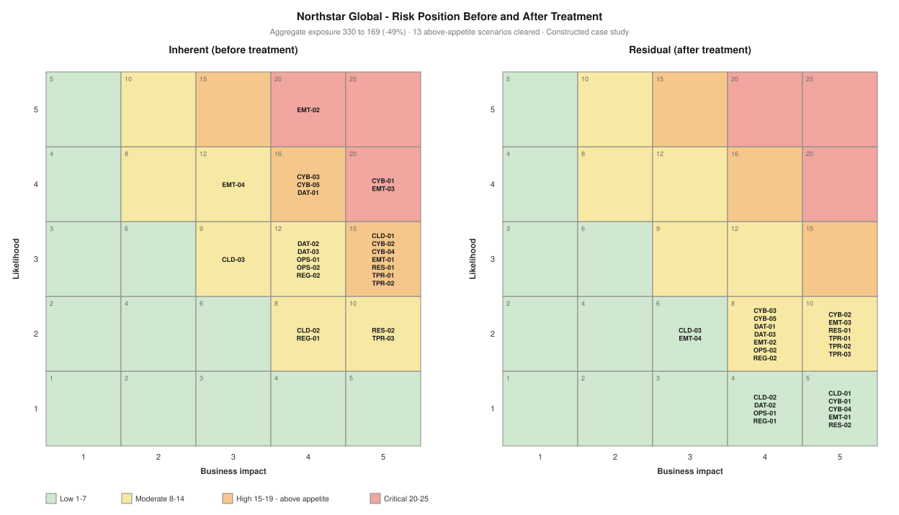

# Project 03 — Control Assessment & Risk Treatment Programme

> ⚠️ Constructed case study. See [`../00-programme/disclaimer.md`](../00-programme/disclaimer.md).

**CRISC Domain 3 — Risk Response & Reporting (32% — the heaviest domain weighting)**
**Role played:** Technology Risk Consultant / Programme Manager · **Duration modelled:** 36 weeks

---

## The one-paragraph version

[Project 02](../02-enterprise-risk-assessment/) established 24 risk scenarios with an aggregate inherent
exposure of 330, of which 13 breached appetite. This project tested the 25 controls intended to address
them, and **not one passed both design and operating effectiveness**. I selected treatment options against
all four responses rather than defaulting to mitigation, sequenced remediation into three waves costed at
**CAD 398,000**, and re-scored residual risk. Exposure reduces to **169 — a 49% reduction — with zero
scenarios remaining above appetite.** Five residual positions are formally accepted rather than treated,
each with named authority, compensating controls, a monitoring threshold and an expiry date.

## Artefacts

| # | Artefact | What it demonstrates |
| --- | --- | --- |
| 1 | [Control assessment methodology](./01-control-assessment-methodology.md) | Design vs operating effectiveness, testing approach, treatment option selection, residual scoring |
| 2 | [Control library](./02-control-library.csv) | 25 controls with type, automation, framework mapping, owner and dual effectiveness ratings |
| 3 | [Issues & findings log](./03-issues-and-findings-log.csv) | 20 findings with severity, root cause, owner, due date and remediation action |
| 4 | [Residual risk register](./04-residual-risk-register.csv) | All 24 scenarios: inherent, treatment, controls, wave, residual, acceptance reference |
| 5 | [Risk treatment plan](./05-risk-treatment-plan.md) | Three costed waves, five formal acceptances, commercial case, 90-day position |
| 6 | [Control testing results](./06-control-testing-results.md) | What passed inspection and failed negative testing, and why |

## Result

| Measure | Inherent | Residual | Change |
| --- | :-: | :-: | :-: |
| Aggregate exposure | 330 | 169 | −49% |
| Above appetite (≥15) | 13 | **0** | −13 |
| Critical (20–25) | 3 | 0 | −3 |
| Low band (≤7) | 0 | 11 | +11 |
| Highest single scenario | 20 | 10 | −50% |

## The three points worth defending in an interview

**1. Design and operating effectiveness are assessed separately, because they cost different amounts to
fix.** Four controls at Northstar were designed correctly and simply not operated — a vulnerability SLA
nobody escalated, a backup restore test not run since 2024. Those are management failures, not engineering
ones, and they form the cheapest tranche of the entire programme. Nine more were designed badly and need
redesign. Eleven don't exist. Collapsing all three into "the control failed" loses the information that
determines the budget.

**2. Inspection is not testing.** Five controls looked correct on inspection and failed under negative
testing. The clearest is C-06: the EDR console reported a healthy estate because it can only report on
enrolled devices, making the 18% coverage gap invisible from inside the tool. A control that measures its
own coverage using itself will always look complete.

**3. Treatment reduces likelihood; impact rarely moves.** Enforcing MFA doesn't make a fraudulent payment
cheaper, it makes it less likely. Fifteen of 24 scenarios keep their original impact score after
treatment. That's why four of the five acceptances land at exactly 10 — likelihood halved, consequence
unchanged. A register where everything reaches the Low band is a sales document, not an assessment.

## Feeds

Appetite thresholds and acceptance authority from
[Project 01](../01-governance-framework/). Scenarios and inherent scores from
[Project 02](../02-enterprise-risk-assessment/). The residual position and five acceptances become the
reporting baseline for Project 07 — Executive Risk Dashboard & KRI Programme.
