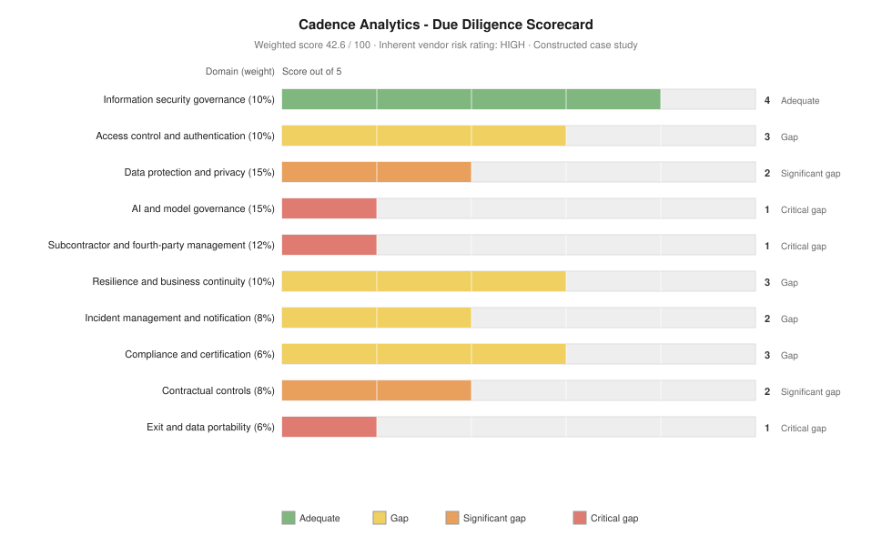

# Project 04 — Third-Party & Supply-Chain Technology Risk Assessment

> ⚠️ Constructed case study. Cadence Analytics is a fictional vendor. See
> [`../00-programme/disclaimer.md`](../00-programme/disclaimer.md).

**CRISC Domains 2 and 3 — Risk Assessment · Risk Response & Reporting**
**Role played:** Technology Risk Consultant · **Duration modelled:** 5 weeks

---

## The one-paragraph version

Northstar wants to onboard an AI demand-forecasting platform that would ingest three years of order
history, pricing and customer contact records. I built a supplier tiering and assessment framework,
applied it across ten weighted domains, and scored the vendor **42.6 / 100 — HIGH risk**. Ten
vendor-specific risk scenarios carry aggregate inherent exposure of **139**, five above appetite. My
recommendation is **Approve with Conditions**: seven conditions precedent before signature, three
post-contract, reducing residual to **72 (−48%)** with none above appetite. Refusal of three specific
conditions converts the recommendation to a rejection.

## Artefacts

| # | Artefact | What it demonstrates |
| --- | --- | --- |
| 1 | [Third-party risk framework](./01-third-party-risk-framework.md) | Supplier tiering, domain weighting, scoring model, evidence standard, conditions precedent vs post-contract |
| 2 | [Due diligence assessment](./02-due-diligence-assessment.csv) | 10 weighted domains with evidence reviewed, findings and ratings |
| 3 | [Vendor risk register](./03-vendor-risk-register.csv) | 10 scenarios scored inherent and residual, each mapped to a binding condition |
| 4 | [Executive recommendation](./04-executive-recommendation.md) | Approve / Approve with Conditions / Reject, with reasoning and dissent triggers |

## The three points worth defending in an interview

**1. Read the scope statement, not the certificate.** Cadence holds ISO 27001 and SOC 2 Type II, and both
are genuine. The SOC 2 scope explicitly excludes the AI inference component — the exact part that
processes Northstar data through a third party. The certification covers the platform *around* the risk
rather than the risk. Reading a scope statement takes five minutes and is the highest-yield activity in
vendor assessment.

**2. Conditions precedent exist because leverage collapses at signature.** Anything genuinely required
must be satisfied before signing. A vendor who won't commit beforehand won't prioritise it afterwards,
when the only remaining remedy is termination — which no organisation exercises over a control gap once
the platform is embedded in business process. Seven of the ten conditions here are precedent for that
reason.

**3. Fourth-party risk is where the assessment actually lives.** The finding that drives this whole
assessment is that the vendor's LLM sub-processor may train on Northstar data by default, and that
sub-processors can be substituted on 30 days' notice with no approval right. Every assurance obtained
attaches to entities that can be replaced by ones nobody has assessed. Assessing the vendor you contracted
with, and stopping there, is the most common structural failure in third-party risk.

## Why the recommendation isn't rejection

A HIGH rating would justify it. But the gaps cluster in AI governance, sub-processor control and exit —
areas where the vendor market as a whole is immature, not where this vendor is unusually weak. Rejecting
and re-procuring would likely reproduce the same three gaps with less leverage, because Northstar would be
later in its own timeline.

The correct response to an immature market is to convert gaps into contractual conditions while leverage
exists. That judgement — and being able to state the three conditions whose refusal flips the answer to
reject — is the substance of the recommendation.

## Feeds

Framework and appetite from [Project 01](../01-governance-framework/). Addresses TPR-01, TPR-02 and TPR-03
from [Project 02](../02-enterprise-risk-assessment/) and findings ISS-13 and ISS-14 from
[Project 03](../03-control-assessment-treatment/). VR-09 compounds accepted risk ACC-01 and is flagged to
the Committee as such.
