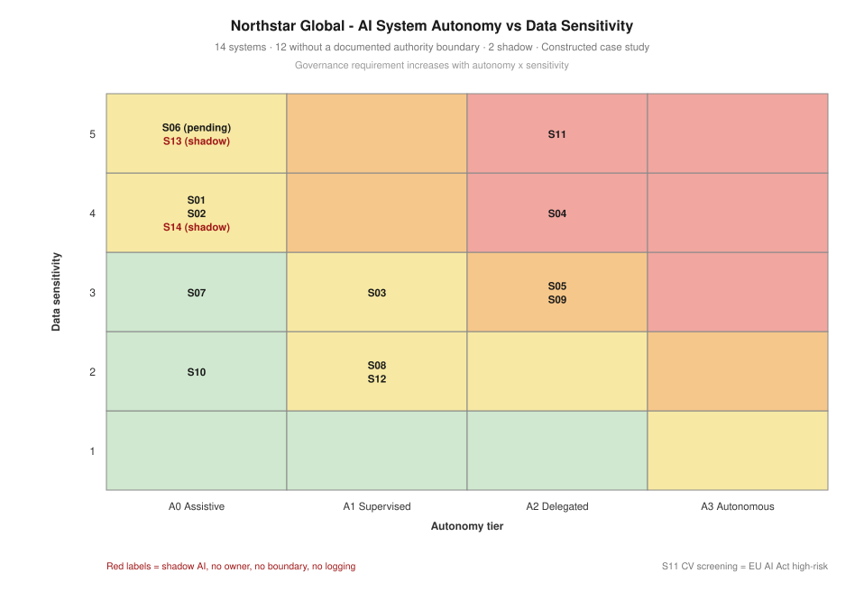

# Project 05 — AI Governance & Emerging Technology Risk

> ⚠️ Constructed case study. See [`../00-programme/disclaimer.md`](../00-programme/disclaimer.md).

**CRISC — spans all four domains** · **Frameworks:** NIST AI RMF 1.0 · ISO/IEC 42001:2023 · EU AI Act
**Role played:** Technology Risk Consultant · **Duration modelled:** 8 weeks

---

## The one-paragraph version

Northstar's Board approved AI investment on a business case; no corresponding risk decision was ever
taken. I discovered and inventoried **14 AI systems** — including two shadow and two embedded in existing
SaaS that nobody had classified as AI — and assessed **16 risk scenarios** carrying aggregate inherent
exposure of **218**, seven above appetite and three Critical. **Six of those sixteen were invisible to the
enterprise assessment completed three months earlier.** Treatment reduces exposure to **92 (−58%)** with
none above appetite. One system was found to be high-risk under the EU AI Act while operating with none of
the required controls.

## Artefacts

| # | Artefact | What it demonstrates |
| --- | --- | --- |
| 1 | [AI risk assessment methodology](./01-ai-risk-assessment-methodology.md) | Why AI fails differently, autonomy tiering, the authority boundary, discovery method, regulatory classification |
| 2 | [AI system inventory](./02-ai-system-inventory.csv) | 14 systems with autonomy tier, sensitivity, owner, boundary, logging, discovery method, EU AI Act class |
| 3 | [AI risk register](./03-ai-risk-register.csv) | 16 scenarios mapped to NIST AI RMF functions, scored inherent and residual, linked to the enterprise register |
| 4 | [Executive recommendation](./04-executive-recommendation.md) | Six recommendations with a suspension decision and two stated acceptances |

## The four points worth defending in an interview

**1. Governance requirement is autonomy × sensitivity, not the word "AI".** A chatbot that suggests text
needs less control than a flow that posts to the ledger, though both use the same model. Four systems sit
at Delegated autonomy and none has a documented authority boundary — their bounds exist only in the intent
of whoever built them.

**2. A boundary that exists only in a prompt is not a control.** Prompts are advisory to the model and can
be overridden by its own reasoning or by injected content. The boundary must be enforced where the
permissions are — identity, API scope, connector configuration. That's the difference between "we told it
not to" and "it cannot".

**3. Embedded vendor AI is the most under-governed category.** Nobody procures "an AI system" — they
procure recruitment software or a CRM that later ships AI features. TalentFilter is high-risk under the EU
AI Act and was never classified as AI at all, because it arrived as an HR tool.

**4. Copilot respects existing permissions, and that is the problem.** Content that was technically
accessible but practically undiscoverable becomes findable in seconds. Oversharing remediation has to
precede broad enablement, not follow it.

## What this assessment could not establish

Bias in the CV screening tool was not independently tested. The finding rests on the absence of vendor
testing evidence, not on measured disparate outcomes — and Northstar cannot test it, because no decision
records are retained. The recommendation creates the records that make future testing possible. It does not
answer whether harm already occurred across the eighteen months the tool has been running.

Shadow AI discovery is also a floor rather than a ceiling: telemetry finds traffic to *known* endpoints.

## Feeds

Appetite for emerging technology — *open but bounded* — from
[Project 01](../01-governance-framework/). Expands EMT-01 to EMT-04 from
[Project 02](../02-enterprise-risk-assessment/) and controls C-17 to C-20 from
[Project 03](../03-control-assessment-treatment/). AI-07 is the same finding as VR-01 in
[Project 04](../04-third-party-risk/), generalised from one vendor into a standing procurement clause.
