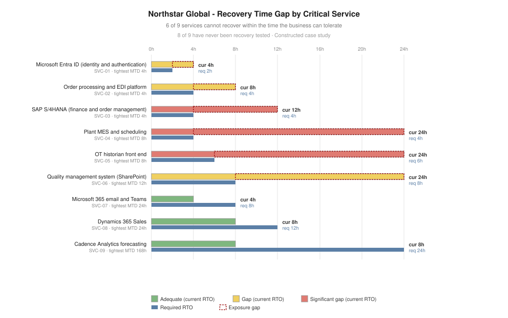

# Project 06 — Technology Resilience & Business Impact Assessment

> ⚠️ Constructed case study. See [`../00-programme/disclaimer.md`](../00-programme/disclaimer.md).

**CRISC Domains 1, 2 and 4** — Governance · Risk Assessment · Technology & Security
**Role played:** Technology Risk Consultant · **Duration modelled:** 10 weeks

---

## The one-paragraph version

RES-01 was accepted at residual 10 under ACC-05 on the basis of an estimate. This assessment replaces the
estimate with a measurement. I ran a business impact analysis across 8 processes, derived required
recovery objectives for 9 critical services, and found **6 of 9 cannot recover within the time the
business can tolerate** — three by 16 hours or more. **Eight of nine have never been recovery tested.** A
ransomware tabletop produced 10 findings, three Critical, including an incident communications plan that
depends on the service the scenario disables. Aggregate business impact reaches **CAD 7.81M at 72 hours**
against a CAD 515,000 improvement programme, of which the first wave — addressing every Critical finding —
costs CAD 34,000.

## Artefacts

| # | Artefact | What it demonstrates |
| --- | --- | --- |
| 1 | [BIA methodology](./01-bia-methodology.md) | MTD vs RTO vs RPO, impact-over-time, workaround capacity, validation against owner over-statement |
| 2 | [Business impact analysis](./02-business-impact-analysis.csv) | 8 processes with MTD, impact at 4/24/72h, workaround capacity, dependencies |
| 3 | [Critical service map](./03-critical-service-map.csv) | 9 services: required vs current RTO/RPO, gap, test status, single points of failure |
| 4 | [Tabletop exercise](./04-tabletop-exercise.md) | Scenario, six injects, 10 findings, and what the exercise says about an existing acceptance |
| 5 | [Resilience improvement plan](./05-resilience-improvement-plan.md) | Three waves, costed, with a recommended amendment to ACC-05 |

## The four points worth defending in an interview

**1. MTD is a business judgement; RTO is a technology commitment.** All four of Northstar's documented
RTOs had been set by IT from platform capability, not derived from business tolerance. That inverts the
whole exercise — the organisation had recorded what it could do and called it what it needed.

**2. The tabletop was designed to fail.** An exercise everyone passes has tested nothing. The injects
attacked the specific assumptions the resilience position rested on, which is why it surfaced a circular
dependency — the communications plan runs on Microsoft 365, which runs on Entra ID, which the scenario
disables. No document review finds that. It appears when someone asks "how are we talking to each other
right now?"

**3. Service-level RTOs do not aggregate to an estate recovery time.** Under pressure, participants
restored in order of visibility rather than dependency, and nobody identified Entra ID as first. Nine
individually acceptable RTOs still produce an unacceptable outage without defined sequencing.

**4. Some gaps are designed around, not closed.** Entra ID's 4-hour RTO is a vendor commitment Northstar
cannot improve. The treatment is to reduce what breaks while identity is unavailable — cached credentials,
break-glass paths, offline procedures — not to attack the number. The instinct to fix the metric rather
than the dependency is a common and expensive error.

## What this says about an earlier decision

ACC-05 accepted RES-01 at residual 10 with compensating controls. The tabletop established that three of
those controls were untested: AD recovery, backup usability, and sensible recovery sequencing. **The
acceptance was sound as a decision and optimistic as an estimate.**

The recommendation is not to withdraw it, but to condition it on Wave 1 completing and to attach a KRI it
currently lacks. Revisiting your own prior conclusion when new evidence arrives — without either defending
it or abandoning it — is the part of this project worth talking about.

## Feeds

Appetite and escalation from [Project 01](../01-governance-framework/). Measures RES-01, RES-02 and CLD-02
from [Project 02](../02-enterprise-risk-assessment/). Tests controls C-10 and C-23 and findings ISS-02,
ISS-09, ISS-17, ISS-18 from [Project 03](../03-control-assessment-treatment/). Three of nine critical
services are vendor-hosted and fall under the framework in [Project 04](../04-third-party-risk/).
