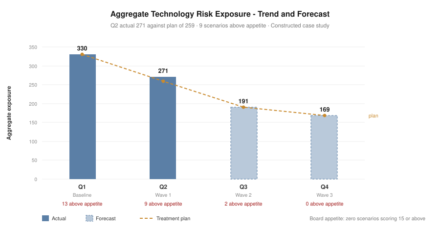

# Project 07 — Executive Risk Dashboard & KRI Programme

> ⚠️ Constructed case study. See [`../00-programme/disclaimer.md`](../00-programme/disclaimer.md).

**CRISC Domain 3 — Risk Response & Reporting (32% — the heaviest domain weighting)**
**Role played:** Head of Technology Risk · **Duration modelled:** ongoing operating cycle

---

## The one-paragraph version

The capstone. Six projects produced registers, treatments and acceptances; this turns them into a
reporting cycle that drives decisions. I consolidated **24 indicators** — 18 KRIs, 4 KCIs, 2 KPIs — each
with thresholds, a data source, an owner and a defined consequence on breach, and built the reporting
layer for three audiences. The Q2 position: aggregate exposure **330 → 271 (−18%)**, all Critical
scenarios cleared, **but 4.6% behind plan** with seven indicators red and two acceptances expiring.

## Artefacts

| # | Artefact | What it demonstrates |
| --- | --- | --- |
| 1 | [Reporting framework](./01-reporting-framework.md) | Audience layering, KRI vs KCI vs KPI, threshold design, escalation routing |
| 2 | [KRI/KCI catalogue](./02-kri-kci-catalogue.csv) | 24 indicators with thresholds, current values, sources, owners, reporting destination |
| 3 | [Board risk report](./03-board-risk-report.md) | One page, no technology, four decisions requested |
| 4 | [Technology Risk Committee pack](./04-technology-risk-committee-pack.md) | Monthly operating pack with decisions, blocked risks and escalations |

## The four points worth defending in an interview

**1. The dashboard reports being behind plan.** Q2 actual is 271 against a plan of 259. A portfolio where
every project succeeds cleanly is a portfolio nobody believes. More usefully, both slipped actions trace to
one dependency — asset inventory coverage — which is why the Committee pack recommends directing the
dependency rather than re-dating the actions individually.

**2. Thresholds sit at the treated baseline, not at zero.** KRI-12 is green at 11 workload identities
holding high-privilege permissions, because 11 is what remains after treatment under an accepted risk.
Setting it at zero would show red permanently, and a permanently red dashboard trains executives to stop
reading it.

**3. KRI, KCI and KPI escalate differently.** Only KRI breaches escalate as risk. A KPI breach is a
delivery problem — real, but routing it through risk escalation devalues every genuine escalation that
follows.

**4. The Board pack contains no technology.** One page. If a Board paper needs the reader to know what a
service principal is, it is the wrong paper. The Board sets appetite and holds management to it; that is
the whole conversation.

## The risk that says the register is wrong

NEW-02 is proposed into the register at 15 — above appetite: *if the asset inventory gap persists, risk
identification remains demonstrably incomplete and reporting understates exposure by an unknown margin.*

It is the only risk whose consequence is that the register itself is unreliable, and it is the common
dependency behind both delivery slips this period. Surfacing the limits of your own reporting, inside the
reporting, is the point.

## Feeds

Consolidates indicators and acceptances from all six preceding projects. Appetite, escalation routing and
committee charter from [Project 01](../01-governance-framework/). Exposure baseline from
[Project 02](../02-enterprise-risk-assessment/). Residual position, waves and acceptances ACC-01 to ACC-05
from [Project 03](../03-control-assessment-treatment/). Vendor conditions from
[Project 04](../04-third-party-risk/). AI registration status from
[Project 05](../05-ai-governance-risk/). Recovery testing and the ACC-05 amendment from
[Project 06](../06-resilience-bia/).
